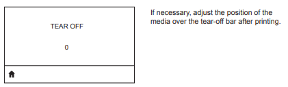

# ラベル停止位置の調整方法

ラベル印刷後の手切り位置、カッターのカット位置、剥離位置などをデフォルトのポジションから変更したいことがあります。その際に有用なのが、TOF設定です。下記を参照し、運用やラベルに適したラベル停止位置に調整してみて下さい。 
 

# 1. コマンドによる変更

### # 設定値確認方法

[Syntax] ! U1 getvar "media.tof"

    ! U1 getvar "media.tof"
    "0"

### # 設定値変更方法

[Syntax] ! U1 setvar "media.tof" "[Dots]"

Dots = 停止位置0 (デフォルト値)からずらすドット数。設定可能なドット数はプリンタによって異なる。  

例）Qln320の場合 -400 ～ 400 が設定可能。

    ! U1 setvar "media.tof" "200"
    ! U1 getvar "media.tof"
    "200"

Programming Guide - media.tof
https://docs.zebra.com/content/tcm/us/en/printers/software/zebra-zpl-ii,-zbi-2,-set-get-do,-mirror,-wml-programming-guide/c-sgd-commands-from-a-to-d/r-sgd-media-tof.html

### # ZPLに埋め込む場合

[Syntax] ^MNM

    ^XA^MNM,50^XZ

詳細は下記を確認すること。
Programming Guide - ^MN
https://docs.zebra.com/content/tcm/us/en/printers/software/zebra-zpl-ii,-zbi-2,-set-get-do,-mirror,-wml-programming-guide/c-zpl-zpl-commands/r-zpl-mn.html

  

# 2. 液晶画面を用いた変更方法

Tear off 設定画面にて変更してください。設定画面の表示・設定変更方法は機種により異なるため、ユーザーズ・ガイドを参照ください。

例）Qln320の場合。  
Menu > Media > Tear Off  

# Zebra-Printer-Adjust-Offset-of-Stop Point After Printing Labels
 ゼブラプリンタのラベル停止位置の調整方法
